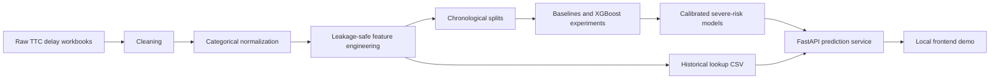

# TTC Delay Prediction & Severe-Risk Forecasting


A calibrated two-output machine learning system that predicts expected TTC bus/streetcar incident delay and calibrated severe-delay risk from incident-time features and prior historical records.

This is incident-time prediction: after an incident is reported, the model estimates delay duration in minutes and the probability of a `30+` or `60+` minute severe delay using information available at report time. It is not future delay forecasting, live TTC monitoring, or a production deployment.

## Results

Final metrics are from chronological holdout evaluation with train `2014-2022`, validation `2023`, and test `2024`. Model selection and probability cutoffs were chosen on validation data only.

| Output | 2024 test metric | Value |
|---|---:|---:|
| Route-history baseline | MAE | 8.98 min |
| Final expected-delay regressor | MAE | 7.76 min |
| Improvement vs. baseline | MAE reduction | about 13.6% |
| `30+` min severe-delay risk | ROC-AUC | 0.905 |
| `30+` min severe-delay risk | PR-AUC | 0.563 |
| `30+` min severe-delay risk | Recall | 0.761 |
| `60+` min severe-delay risk | ROC-AUC | 0.952 |
| `60+` min severe-delay risk | PR-AUC | 0.437 |
| `60+` min severe-delay risk | Recall | 0.822 |

## Figures and Demo

### Performance Figures

Generated public figures can be recreated from local report outputs:

```bash
python3 -m src.analysis.create_public_figures
```


### Frontend Screenshots

Frontend screenshots can be added under `docs/images/` after running the local demo. No fabricated screenshots are included.

## Problem

TTC delay records include incident details such as route, direction, incident type, location, mode, timestamp, and delay duration. The project asks:

- Given a newly reported bus or streetcar incident, what delay duration should be expected?
- What is the calibrated risk that the incident becomes severe, using `30+` and `60+` minute thresholds?

The primary target is `Min Delay` regression. Severe-delay classification is a secondary output for risk communication.

## Technical Approach

- Deterministic cleaning and categorical normalization for `mode`, `Route`, `Direction`, `Incident`, and `Location`.
- Target policy of `0 <= Min Delay <= 240` for the main modeling dataset.
- Chronological splits: train `2014-2022`, validation `2023`, test `2024`.
- Leakage-safe historical features using only prior records, with `shift(1)` in feature building and `ts < prediction timestamp` in API lookup.
- Route-history baseline comparison before model training.
- Fixed XGBoost experiments selected on validation data, with final expected-delay regression using a log-target XGBoost model.
- Calibrated severe-delay classifiers for `Min Delay >= 30` and `Min Delay >= 60`.
- FastAPI local prediction API plus a static local frontend demo.
- API historical lookup computes model historical features automatically from local prior records when basic incident details and timestamp are provided.



## Repository Structure

```text
src/data/       cleaning, loading, categorical normalization, category audits
src/features/   target diagnostics and leakage-safe feature engineering
src/models/     baselines, XGBoost training, experiments, calibration, explainability
src/api/        FastAPI app, prediction service, historical lookup, static frontend
tests/          lightweight unit and API tests
docs/           curated public docs, with development notes archived separately
data/           local raw/processed data placeholders only
reports/        local generated report placeholders only
artifacts/      local generated model artifact placeholders only
```

Raw TTC files, processed CSVs, generated reports, and model artifacts are intentionally gitignored.

## Quickstart

```bash
python3 -m venv .venv
source .venv/bin/activate
pip install -r requirements.txt
pytest
```

Run the local API and frontend:

```bash
uvicorn src.api.app:app --reload
```

Open:

```text
http://127.0.0.1:8000/
```

The API expects local artifacts by default:

```text
artifacts/calibration/calibrated_two_output_model.joblib
data/processed/modeling/modeling_dataset.csv
```

Override them with environment variables if needed:

```bash
TTC_MODEL_ARTIFACT_PATH=/path/to/calibrated_two_output_model.joblib \
TTC_HISTORICAL_FEATURE_DATA_PATH=/path/to/modeling_dataset.csv \
uvicorn src.api.app:app --reload
```

## API Endpoints

- `GET /`
- `GET /health`
- `GET /model-info`
- `GET /historical-lookup-info`
- `GET /model-options`
- `GET /route-options`
- `GET /route-locations`
- `POST /validate-route-location`
- `POST /match-location`
- `POST /compute-historical-features`
- `POST /predict-delay`

Example prediction request using basic fields only:

```bash
curl -X POST http://127.0.0.1:8000/predict-delay \
  -H "Content-Type: application/json" \
  -d '{
    "mode": "bus",
    "Route": "29",
    "Direction": "N",
    "Incident": "Mechanical",
    "Location": "Dufferin Station",
    "timestamp": "2024-02-03T08:30:00"
  }'
```

When `timestamp` is provided, `/predict-delay` derives time fields and computes historical features from local records strictly before the prediction timestamp. Same-timestamp and future rows are excluded. Manual historical feature overrides are available for debugging but are not the default API behavior.

## Optional Reproducibility Commands

Full regeneration requires local TTC raw files and writes gitignored outputs under `data/processed/`, `reports/`, and `artifacts/`.

```bash
python3 -m src.data.clean_data
python3 -m src.features.diagnose_target --input data/processed/ttc_delays_cleaned.csv --output-dir reports/target_diagnostics
python3 -m src.features.build_features --input data/processed/ttc_delays_cleaned.csv --output-dir data/processed/modeling --max-delay-minutes 240
python3 -m src.models.evaluate_baselines --modeling-dir data/processed/modeling --output-dir reports/baselines
python3 -m src.models.train_model --modeling-dir data/processed/modeling --reports-dir reports/models --artifacts-dir artifacts/models --baseline-report reports/baselines/baseline_metrics.json
python3 -m src.models.run_experiments --modeling-dir data/processed/modeling --baseline-report reports/baselines/baseline_metrics.json --fixed-model-report reports/models/model_metrics.json --reports-dir reports/experiments --artifacts-dir artifacts/experiments --selection-metric validation_mae
python3 -m src.models.train_risk_models --modeling-dir data/processed/modeling --selected-regressor-path artifacts/experiments/selected_experiment.joblib --reports-dir reports/risk_models --artifacts-dir artifacts/risk_models --thresholds 30,60
python3 -m src.models.calibrate_risk_models --modeling-dir data/processed/modeling --phase-7b-artifact-path artifacts/risk_models/two_output_model.joblib --selected-regressor-path artifacts/experiments/selected_experiment.joblib --reports-dir reports/calibration --artifacts-dir artifacts/calibration --thresholds 30,60
python3 -m src.models.explain_models --modeling-dir data/processed/modeling --artifact-path artifacts/calibration/calibrated_two_output_model.joblib --output-dir reports/explainability
```

Convenience `make` targets are also available; see [Makefile](Makefile).

## Documentation

- [Docs index](docs/README.md)
- [Model card](docs/model_card.md)
- [Technical report](docs/technical_report.md)
- [Architecture](docs/architecture.md)
- [API service](docs/api_service.md)
- [Historical feature lookup](docs/historical_feature_lookup.md)
- [Final QA checklist](docs/final_qa_checklist.md)

## Limitations

- Local demo only; the project is not production deployed.
- Historical lookup uses a local CSV, not live TTC feeds or a production feature store.
- Predictions are only as current as the local dataset and model artifact.
- Weather enrichment is not implemented.
- Location matching is approximate assistance based on normalized text and optional local GTFS route-stop validation; it is not geocoding.
- The model should not be used for operational decisions without validation on live data and a deployment-grade monitoring plan.

## Resume-Ready Highlights

- Built a reproducible leakage-aware ML pipeline with chronological evaluation, prior-only historical features, and validation-only model selection.
- Improved 2024 holdout MAE from an 8.98 minute route-history baseline to 7.76 minutes with a log-target XGBoost regressor.
- Added calibrated `30+` and `60+` minute severe-delay probabilities behind a local FastAPI demo that computes historical features automatically from prior records.
