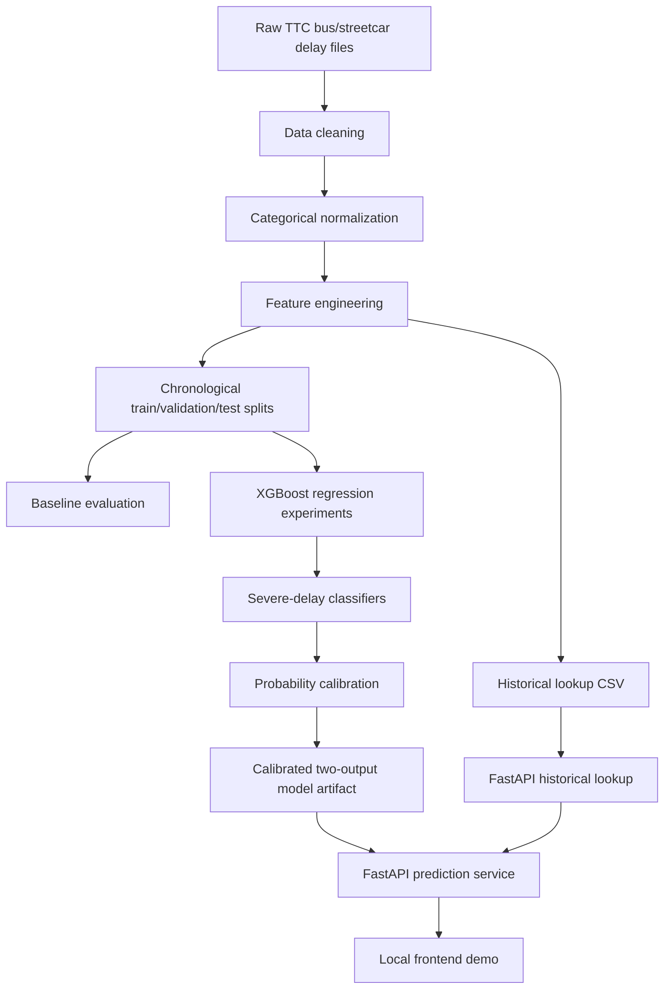

# Architecture

## Components

**Data cleaning** standardizes TTC raw workbooks, parses timestamps, keeps audit fields, and writes local processed CSVs.

**Categorical normalization** applies deterministic cleanup for mode, route, direction, incident, and location before feature creation.

**Feature engineering** creates time features and leakage-safe historical features using prior records only.

**Model training** evaluates route-history baselines and fixed XGBoost regression experiments with chronological train/validation/test splits.

**Calibration** fits severe-delay classifiers for `30+` and `60+` minute thresholds and calibrates probabilities using validation-selected methods.

**Historical lookup** computes missing historical features at inference from local prior records where `ts < prediction timestamp`.

**API** exposes model metadata, historical lookup info, route/location helpers, and `/predict-delay`.

**Frontend** is a static local demo served by FastAPI. It is not a deployed product.

## Local Outputs

The following outputs are generated locally and are not committed:

- raw TTC files under `data/raw/`
- processed/modeling CSVs under `data/processed/`
- model artifacts under `artifacts/`
- generated reports and plots under `reports/`
