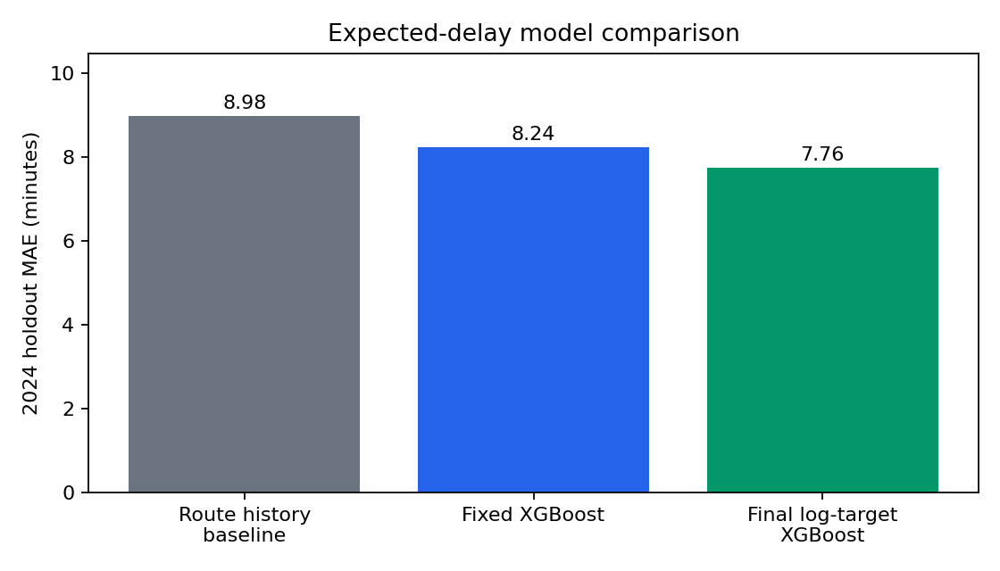
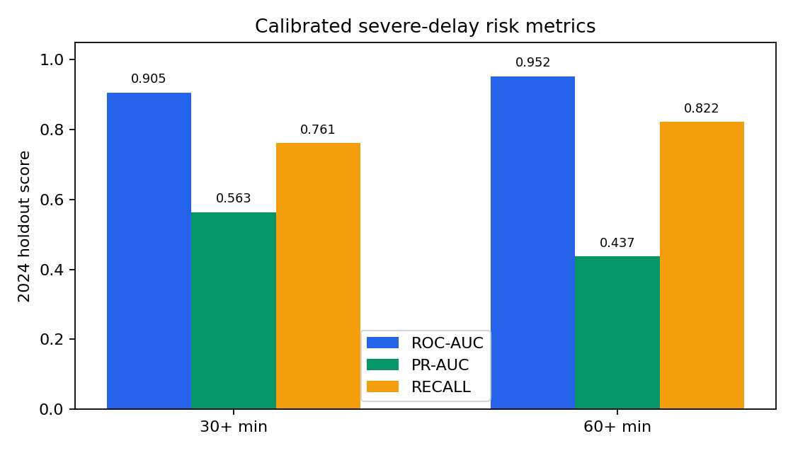

# Technical Report

## Overview

This project turns exploratory TTC bus and streetcar delay analysis into a reproducible local ML system. The final workflow predicts expected incident delay in minutes and calibrated severe-delay risk from incident-time fields plus prior historical records.

## Dataset and Target Policy

The source data consists of local TTC bus and streetcar incident delay workbooks covering 2014-2024. The primary target is `Min Delay`. The main modeling dataset keeps records where `0 <= Min Delay <= 240`, excluding extreme target values from the portfolio model while retaining cleaned data separately for audit.

## Cleaning and Categorical Normalization

Cleaning standardizes columns, parses dates/times, preserves source metadata, and combines bus and streetcar data. Categorical normalization is deterministic and target-free:

- `mode` is normalized to bus or streetcar.
- `Route` is cleaned conservatively while preserving route-like identifiers.
- `Direction` is mapped to `N`, `E`, `S`, `W`, `B`, or `Unknown`.
- `Incident` variants are mapped to curated operational categories.
- `Location` receives safe text cleanup only.

## Feature Engineering

Feature engineering creates time features, cyclic encodings, categorical features, and prior-only historical features. v1 features cover broad route, incident, mode, global, and route-hour history. v2 features add more specific route-incident, mode-incident, route-direction, location, 30-day mean, count, and severe-rate features.

## Leakage Prevention

The final evaluation uses chronological splits: train `2014-2022`, validation `2023`, and test `2024`. Historical features use only earlier rows. API lookup filters local records to `ts < prediction timestamp`, excluding same-timestamp and future incidents. `Min Delay`, `Min Gap`, source metadata, and post-incident fields are excluded from model inputs.

## Baseline Modeling

The main baseline is a leakage-safe route-history delay estimate with fallback behavior. On the 2024 holdout split, this baseline has MAE of 8.98 minutes.

## Regression Modeling

Fixed XGBoost regression experiments compare a reference model, sample-weighted training, log-target training, and mode-specific models. Selection uses validation MAE only. The selected final regressor uses a log-transformed target and achieves 7.76 minute MAE on the 2024 holdout split, about 13.6% lower MAE than the route-history baseline.

## Severe-Delay Risk Classification

The secondary outputs estimate risk for `Min Delay >= 30` and `Min Delay >= 60`. These classifiers support risk communication alongside the expected-delay regression output. On the 2024 holdout split, the `30+` classifier reaches ROC-AUC 0.905, PR-AUC 0.563, and recall 0.761; the `60+` classifier reaches ROC-AUC 0.952, PR-AUC 0.437, and recall 0.822.

## Probability Calibration

Calibration compares uncalibrated, sigmoid, and isotonic methods. Base classifiers are trained on pre-2022 training rows, calibrators are fit on 2022 rows, and method/cutoff selection is done on 2023 validation data. The latest local run selected isotonic calibration for both severe-delay thresholds.

## Error Analysis

Residual reports group errors by delay bucket, hour, month, mode, route, and incident. The analysis is used to identify model weaknesses and prioritize feature engineering without changing the test-selection protocol.

## Explainability

Explainability reports use permutation importance on approved model input columns. They summarize which features most affect expected-delay and severe-risk outputs for sampled rows. These diagnostics are not causal claims.

## API and Frontend Demo

The FastAPI service loads a local calibrated two-output artifact. `/predict-delay` accepts basic incident details plus timestamp, derives time features, and computes historical features from local prior rows. A static frontend served by the API provides a local demo with guided inputs, route/location validation when GTFS is available, and severe-risk output cards.

## Final Metrics

| Output | 2024 test metric | Value |
|---|---:|---:|
| Route-history baseline | MAE | 8.98 min |
| Final expected-delay regressor | MAE | 7.76 min |
| Improvement vs. baseline | MAE reduction | about 13.6% |
| `30+` severe-delay risk | ROC-AUC / PR-AUC / recall | 0.905 / 0.563 / 0.761 |
| `60+` severe-delay risk | ROC-AUC / PR-AUC / recall | 0.952 / 0.437 / 0.822 |

## Limitations

- Local demo, not production deployment.
- No live TTC feed integration.
- Historical features are only as current as the local modeling CSV.
- No weather enrichment.
- Approximate text location matching only.
- Further live validation is required before operational use.

## Future Work

- Add weather and event context if available at incident time.
- Replace local CSV lookup with an indexed feature store for deployed use.
- Evaluate drift and calibration on newer live data.
- Add deployment monitoring and model governance before any operational use.
